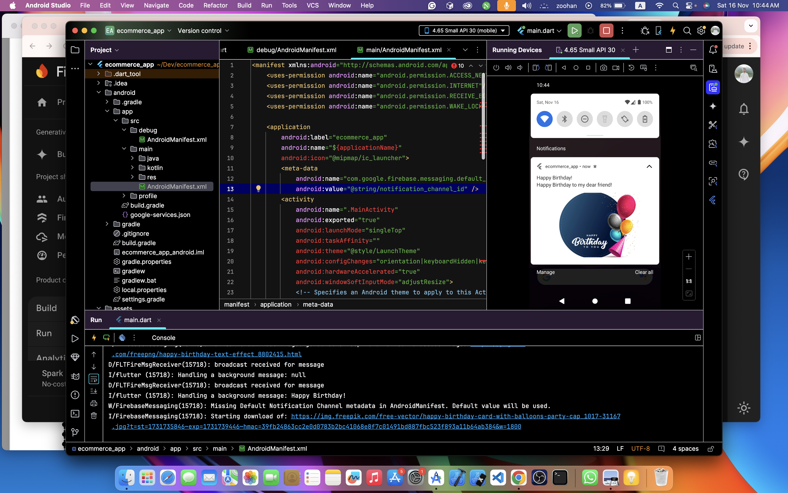

# 🛒 Flutter E-Commerce App

A full-featured **Flutter-based e-commerce application** with a clean, scalable architecture, offline-first support, and a smooth user experience.  
Built with **Provider** for state management and powered by the **Fakestore API**.

---

## 🚀 Features

### 🛍 Product Browsing & Search
- Browse products with **title, description, price, image, and category**.
- Real-time search and filtering.

### ⚙️ State Management
- Efficient state handling using the **Provider** package.

### 🌐 API Integration
- Fetch product data using the **http** package.

### 📶 Offline Support
- Shows Wi-Fi status (**red/green**) using `connectivity_plus`.
- Displays **snackbar** when offline.
- Caches previously fetched products and cart data with `shared_preferences`.

### 🛒 Cart Management
- Saves cart items, quantities, and total in **Cloud Firestore**.
- Adjustable quantities (**1–10**) via dropdown.

### 🔐 Secure Authentication
- Firebase Authentication with **"Remember Me"** option.
- Credentials stored securely with `flutter_secure_storage`.

### 🖼 Image Caching
- Offline image loading with `cached_network_image`.

### 🔔 Push Notifications
- Implemented using `firebase_messaging`.
- Prompts for permissions via `app_settings` if denied.

### 🎨 UX Enhancements
- Loading spinners, snackbars, and subtle animations.
- Smooth and intuitive navigation between pages.

---

## 📲 Download & Links

- **GitHub Repository**: [E-Commerce App Repo](https://github.com/MuhammadBilalAkbar/ecommerce_app)
- **APK Download**: [Download APK](https://drive.google.com/drive/folders/1B0l811jXF51URSym0WOaZFFWP5B6faLo)
- **YouTube Demo**: [Watch on YouTube](https://www.youtube.com/watch?v=KNpcXrg91qc&list=PLjsAnKhr2SrjwJ2ESv-M3H0il3PR_8Apr&index=2)
- **LinkedIn Showcase**: [View Post](https://www.linkedin.com/posts/mohammad-bilal-akbar-981649189_e-commerce-app-apk-google-drive-activity-7357001228830064641-PzqJ)

---

## 🛠 Tech Stack

- **Framework**: Flutter
- **State Management**: Provider
- **Backend**: Firebase (Auth, Firestore, Messaging)
- **API**: Fakestore API
- **Local Storage**: shared_preferences, flutter_secure_storage
- **Offline Image Caching**: cached_network_image
- **Connectivity**: connectivity_plus

---

## 📷 Screenshots


---

## 📌 Installation

1. Clone the repository:
   ```bash
   git clone https://github.com/MuhammadBilalAkbar/ecommerce_app.git
